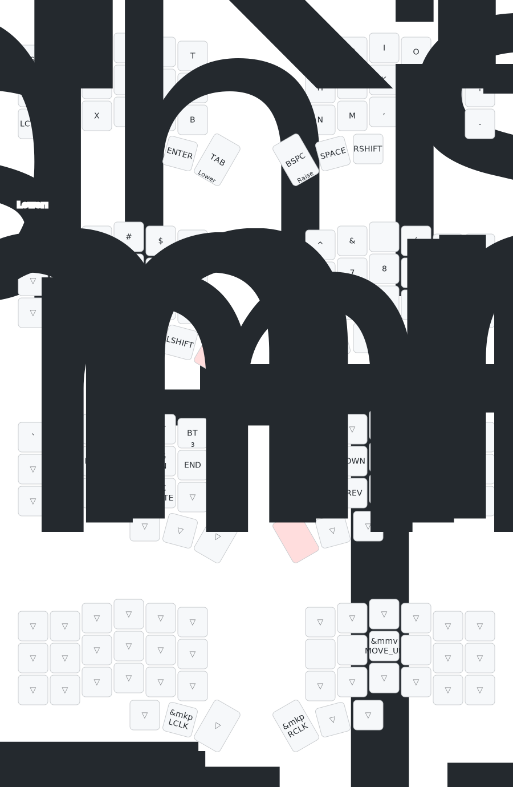

# ZMK Corne Keyboard Configuration

ZMK firmware configuration for the Corne (CRKBD) keyboard.

## Keymap

### Layers

- **Base Layer**: QWERTY layout with home row mods
- **Lower Layer**: Numbers and symbols
- **Raise Layer**: Navigation, media controls, and Bluetooth
- **Mouse Layer**: Vim-style mouse navigation with HJKL

### Mouse Layer Features

The mouse layer provides vim-style cursor control:
- **H** - Move cursor left
- **J** - Move cursor down
- **K** - Move cursor up
- **L** - Move cursor right
- **TAB** - Left click
- **BSPC** - Right click

**Activation**: Double-tap left SHIFT to toggle mouse layer on/off

### Keymap Visualization



## Building

This configuration requires ZMK with mouse support enabled (`CONFIG_ZMK_POINTING=y`).

### Generate Keymap Visualization

To generate an updated keymap visualization:

```bash
# Install keymap-drawer (if not already installed)
pipx install keymap-drawer

# Generate visualization
make keymap-draw
```

This creates:
- `corne_keymap.yaml` - Parsed keymap data
- `corne_keymap.svg` - Visual representation
- `corne_keymap.png` - PNG version (requires inkscape)

## Features

- **Eager Debouncing**: Fast response with 1ms press / 10ms release
- **ZMK Studio**: Enabled for real-time keymap updates
- **Mouse Emulation**: Full pointer control from keyboard
- **Tap Dance**:
  - `/` key: single tap `/`, double tap `\`
  - Left SHIFT: single tap SHIFT, double tap toggle mouse layer
