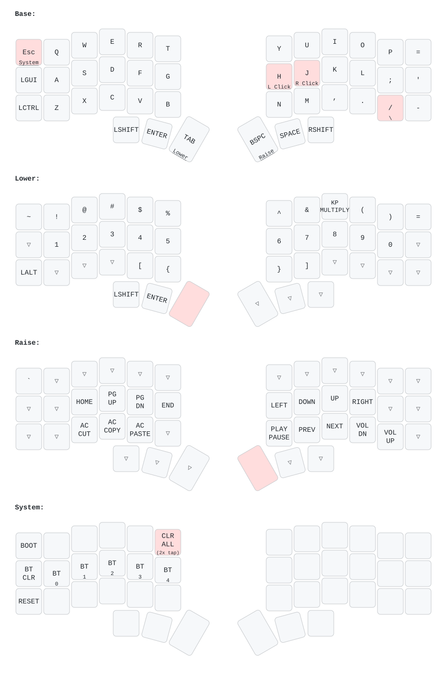

# ZMK Corne Hexfusion Configuration

ZMK firmware configuration for the Corne (CRKBD) keyboard.

## Keymap

### Layers

- **Base Layer** (0): QWERTY layout
- **Lower Layer** (1): Numbers and symbols — hold `TAB` (`&lt 1 TAB`)
- **Raise Layer** (2): Navigation and media controls — hold `BSPC` (`&lt 2 BSPC`)
- **System Layer** (3): Bluetooth, bootloader, and reset — see below

### System Layer

Bluetooth, bootloader, and reset controls.

**Activation**: Hold the top-left `ESC/SYS` key for **5 seconds**. Tap it for
`ESC`; the long hold prevents accidental triggers. The layer is momentary, so
keep holding while you press the target key.

| Key | Action |
|-----|--------|
| Top-left (`ESC/SYS`) | Enter bootloader (flashing) |
| Top row, 6th key | Clear all BT bonds (double-tap) |
| Middle-left | Clear current BT bond |
| Middle row, keys 1–5 | Select BT profile 0–4 |
| Bottom-left | System reset |

To pair a device: hold `ESC/SYS` and tap a profile key (0–4).

### Mouse

Left and right click live on the keyboard so a thumb-operated trackball
(Ploopy Nano 2) can stay movement-only.

- **H**: tap `h`, hold = left click (hold + roll ball = drag)
- **J**: tap `j`, hold = right click

Clicks use a `tap-preferred` hold-tap (`mm`) with `require-prior-idle-ms=150`
so mid-word `h`/`j` never misfire a click. Pointer speed is tuned host-side
(flat accel profile), not in this firmware.

### Keymap Visualization



## Building

### Generate Keymap Visualization

To generate an updated keymap visualization:

```bash
# Install keymap-drawer (if not already installed)
pipx install keymap-drawer

# Generate visualization
make keymap
```

This creates:
- `corne_keymap.yaml` - Parsed keymap data
- `corne_keymap.svg` - Visual representation
- `corne_keymap.png` - PNG version (requires inkscape)

## Features

- **Tap Dance**:
  - `/` key: single tap `/`, double tap `\`
  - Clear-all-bonds key (System layer): double-tap required to fire `BT_CLR_ALL`
- **Hold-Tap**:
  - `ESC/SYS` key: tap `ESC`, hold 5s for the System layer
  - `H` / `J`: tap letter, hold for left / right mouse click
